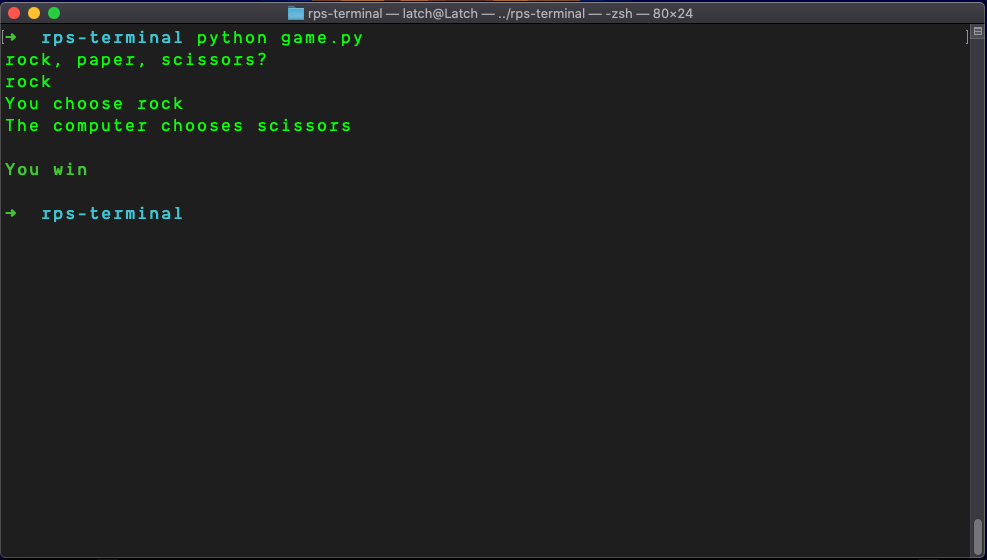

# Rock, Paper, Scissors, Command Line

This game is built to run in your terminal.

## Getting Started
To get the game to run open your terminal in the folder containing the game and type..
```console
  $ python game.py
```
The game will then ask you to choose either rock, paper or scissors. Type in your answer and hit enter.

To initiate the game again, just run the `game.py` again.

## Screenshot


#### Author
Latch Jack - You can contact me via [Twitter](https://twitter.com/LatchCodes "My twitter profile") or via [email](mailto:latch.jack@gmail.com "my email").

:)